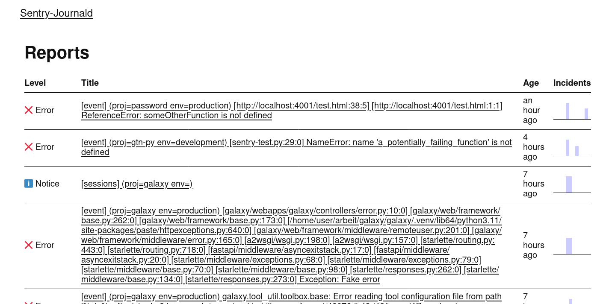
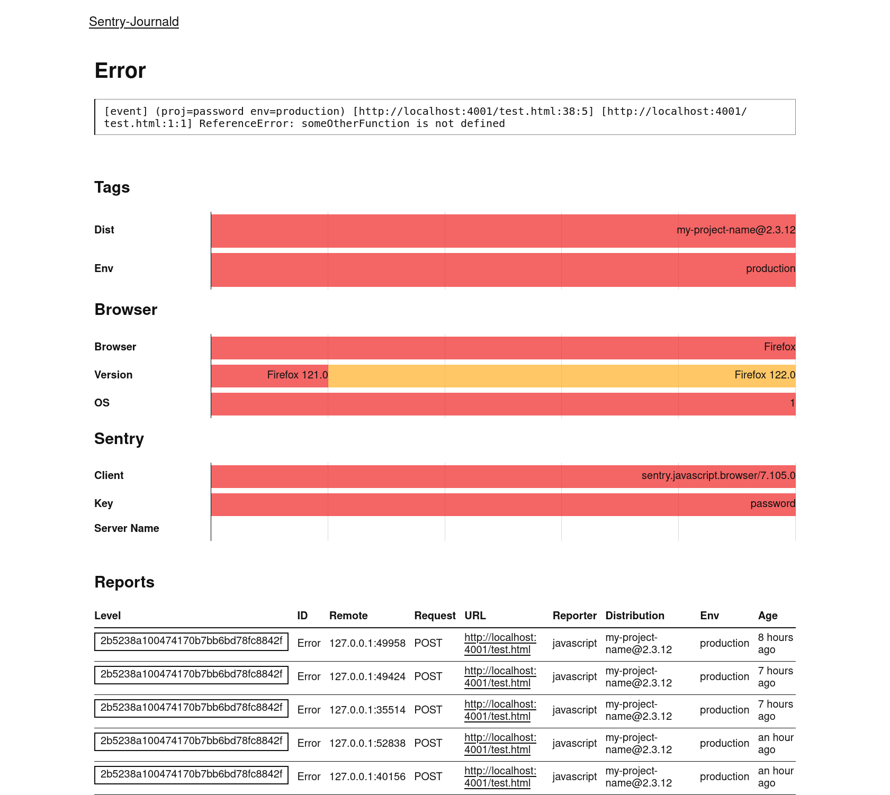
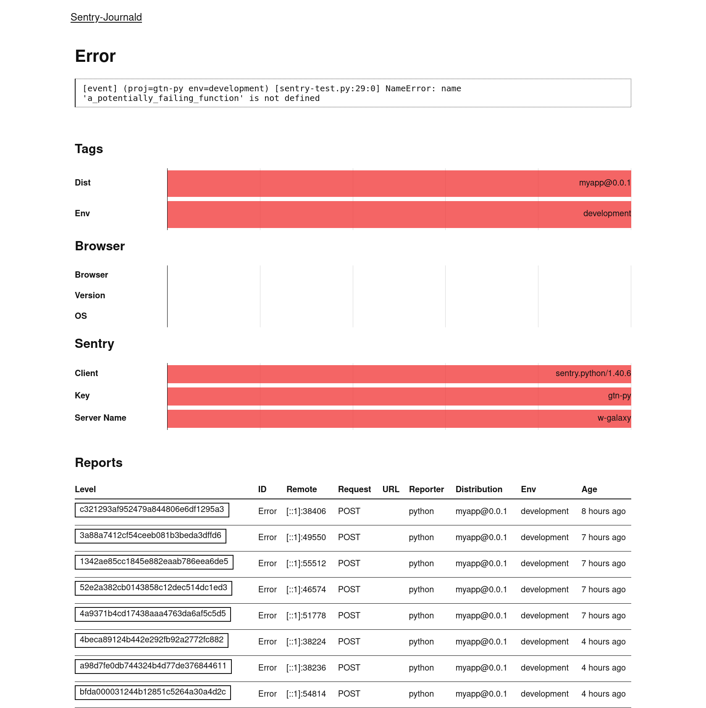

# Sentry-Journald

Do you like sentry's data collection, but don't want to run a complicated sentry server? Do you still want to see those cute lil error messages?
Boy howdy do I have the 800 lines of rubbish Golang code for you!

```
$ journalctl -f # optionally -t sentry
Mar 06 13:13:22 w-galaxy sentry[467887]: [event] (proj=web-demo env=production) [http://localhost:4001/test.html:38:5] [http://localhost:4001/test.html:1:1] ReferenceError: someOtherFunction is not defined
Mar 06 13:13:51 w-galaxy sentry[467887]: [event] (proj=py-demo env=development) [sentry-test.py:29:0] NameError: name 'a_potentially_failing_function' is not defined
Mar 06 13:13:51 w-galaxy sentry[467887]: [event] (proj=py-demo env=development) Something went wrong
```

If you want the full data it's stuffed into additional fields in the `journald -o json` format.

```json
{
  "MESSAGE": "[event] (proj=my-python-project env=staging) [sentry-test.py:36:0] [sentry-test.py:39:0] [sentry-test.py:42:0]  NameError: name 'a_certainly_failing_function' is not defined",
  "MESSAGE_ID": "1f53e8bc372f44cf9ae25b576135d6df",
  "PRIORITY": "3",
  "PROJECT_ID": "1",
  "REMOTE_ADDR": "[::1]:59970",
  "REQUEST_HEADERS": "null",
  "REQUEST_METHOD": "POST",
  "REQUEST_REMOTE_ADDR": "[::1]:59970",
  "REQUEST_URL": "",
  "SENTRY_CLIENT": "sentry.python/1.41.0",
  "SENTRY_CONTEXTS": "{\"level\":\"info\",\"runtime\":{\"build\":\"3.11.7 (main, Dec 18 2023, 00:00:00) [GCC 13.2.1 20231011 (Red Hat 13.2.1-4)]\",\"name\":\"CPython\",\"version\":\"3.11.7\"},\"trace\":{\"parent_span_id\":null,\"span_id\":\"bc764aa57d129744\",\"trace_id\":\"6e80e23f63f54be4b1871e55e7e01ed6\"},\"user\":\"hexylena\"}",
  "SENTRY_DIST": "myapp@0.0.1",
  "SENTRY_ENVIRONMENT": "staging",
  "SENTRY_KEY": "my-python-project",
  "SENTRY_MESSAGE_KEY": "(proj=my-python-project) NameError: name 'a_certainly_failing_function' is not defined",
  "SENTRY_PLATFORM": "python",
  "SENTRY_RELEASE": "myapp@0.0.1",
  "SENTRY_SERVER_NAME": "w-galaxy",
  "SENTRY_STACKTRACE": "{\"frames\":[{\"filename\":\"sentry-test.py\",\"function\":\"\\u003cmodule\\u003e\",\"in_app\":true,\"lineno\":42,\"colno\":0},{\"filename\":\"sentry-test.py\",\"function\":\"a\",\"in_app\":true,\"lineno\":39,\"colno\":0},{\"filename\":\"sentry-test.py\",\"function\":\"b\",\"in_app\":true,\"lineno\":36,\"colno\":0}]}",
  "SENTRY_TIMESTAMP": "2024-03-08T10:32:05.887578Z",
  "SENTRY_VERSION": "7",
  "SYSLOG_IDENTIFIER": "sentry",
}
```

## Configuration

There is a `--port` flag (also available as `PORT`) to configure a port from the environment.

Just like real sentry there is no actual authentication of the user, so, it is up to you to add any filtering and anti-spam/abuse you want.

## systemd

A unit file is included for your convenience.

## Comparison

suckless? no this sucks more. (but we don't have torchlit walks, so, tradeoffs ig.)

This is intentionally pretty minimal.

Feature | Actual Sentry | This Rubbish
--- | --- | ---
Receives errors | ✅ | ✅
Receives 'user messages' | ✅ | ✅
Processes sessions/breadcrumbs | ✅ | ❌
Aggregates & deduplicates error messages | ✅ | 🤷‍♀️
Provides nice breakdowns of user/browser version/etc | ✅ | 🤷‍♀️
Supports attachments | ✅ | ❌
Has something like spam measures | ✅ | ❌

It's in a similar vein to [hauxir/errorpush](https://github.com/hauxir/errorpush), except instead of shoving it into a DB and asking you to write complicated SQL queries, we shove it into journald and ask you to write complicated jq/awk/sort/uniq/greps to process your data. Which is better? We may never know.

## Screenshots

Overview | Detail (JS) | Detail (Py)
--- |--- | ---
 |  | 

## Did you find this useful?

Please let me know! (matrix/email/fediverse are all fine.)

## License

EUPL-1.2 (it's like agpl! but european flavour.)
